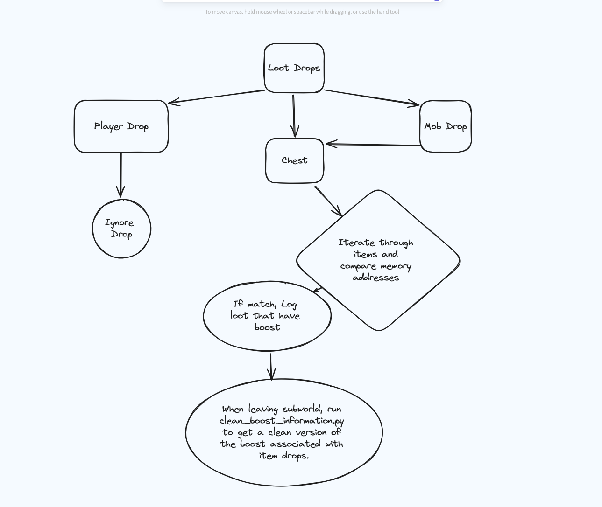

# SB Boost Collector
Credits: Alexrns    

# About
Plugin to log all boost information within Starbreak subworlds.  

Similar to loot logger, this collects the information in the same manner, but uses the information differently.
After every floor change, we log the loot within a log file (boost_collector.log) following this format:

```
{"name": "Kantikoy Repeater", "boosts": [{"enum": "STAT_PENETRATING", "stat": 32, "val": 0}]}
{"name": "Acrotic Warp", "boosts": [{"enum": "STAT_ITEMCRITCHANCE", "stat": 24, "val": 500}]}
```

Once you leave the subworld. The plugin will run the following file `clean_boost_information.py` (You need Python installed to call this file).
This will iterate through all the items in the log file and and insert them in a clean format into a new file (formattted_boost_file.json), 
if the item doesn't exist and the boost doesn't exists for the item.

```
{
        "name": "Valenki",
        "boosts": [
            {
                "boost_enum": "STAT_CRITMULT",
                "boost_id": 20,
                "values": [
                    50
                ]
            }
        ]
    },
    {
        "name": "Sabatons",
        "boosts": [
            {
                "boost_enum": "STAT_DAMAGEBONUS",
                "boost_id": 18,
                "values": [
                    5
                ]
            },
            {
                "boost_enum": "STAT_WALKSPEED",
                "boost_id": 11,
                "values": [
                    3
                ]
            },
            {
                "boost_enum": "STAT_JUMPSPEED",
                "boost_id": 12,
                "values": [
                    1
                ]
            }
        ]
    },
```

  
*Here is a diagram giving a visual on how the logic works*

 # Usage
Add the `sb_boost_collector.py` to the plugin folder of your sbpe  
Add the `clean_boost_information.py` to the root folder of sbpe     

Plugin should now load and create the missing files/directory on sbpe launch.  
  
