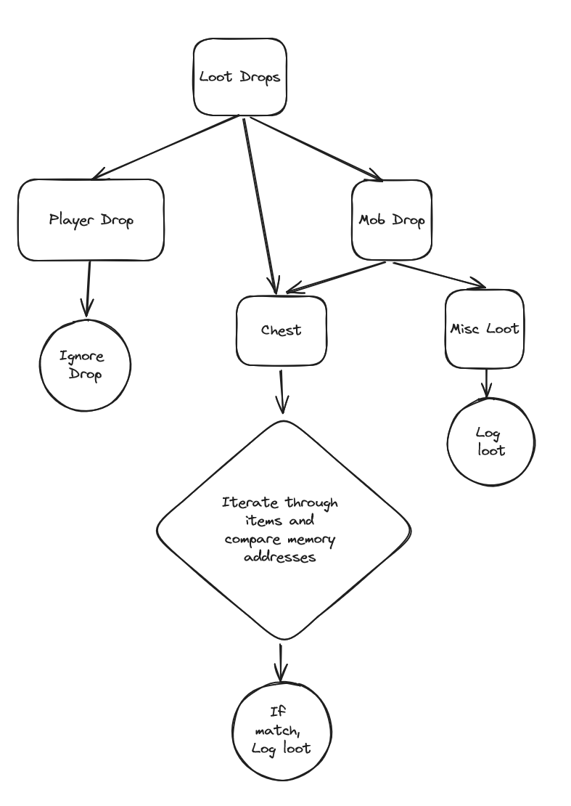

# SB Loot Logger
Credits: Alexrns    

# About
Plugin to log all non-player loot from within Starbreak subworlds.  

The plugin offers to two different modes to log/view loot information:  
A stack-based GUI display that renders x amount of items to the screen gotten within the subworld.  
Log file that contains all loot from within a subworld that can be easily parsed.  

## Features:  
File based Logging  
GUI stack based logging  
Coloured GUI display on boost amount (0, 1, 2, 3, 4)  
Misc Filtering  (File Log / GUI)  
Slot filtering  (File Log / GUI)   
Item filtering  (File Log / GUI)  

## How it works
This works by iterating through all the game objects and logging the Non-Player Loot objects as you progress throughout the map.  

  
*Here is a diagram giving a visual on how the logic works*

Loot logging is done in two steps:  
Subworld  
Subworld Floors  

With a subworld floor, we track all loot that is dropped within the floor and only log it under these conditions  
Either:  
    You leave early (Homing, Entrance portal on Floor 0, Death and exit),  
    You move to the next floor  

With the subworld itself, once you leave the subworld you're in and return to the lobby/home. We take all the Subworld Floors loot   
and condense them into a array that you can iterate and manipulate to your extent.  

The overall goal with this plugin was to get an understanding of SBPE to make other plugins  

# Usage
Add the `sb_loot_logger.py` to the plugin folder of your sbpe  

Within config, add "sb_loot_logger" to the priority list under "manger" in `config.ini`  

Add the contents of `sb_loot_logger config.ini` to your sbpe `config.ini` file  

Add the toggle to "plugin_keybinds" in sbpe `config.ini`  

Plugin should now load.  
Add any specific items you want to ignore to FILTERED_ITEMS  
IF you want to ignore any item groups, do it within the `config.ini`  
```
FILTERED_ITEMS = """
Kantikoy Repeater
Talons
1 EC
"""
```

Future Possible Features:  
Logging Players when a specific item(s) drops   
